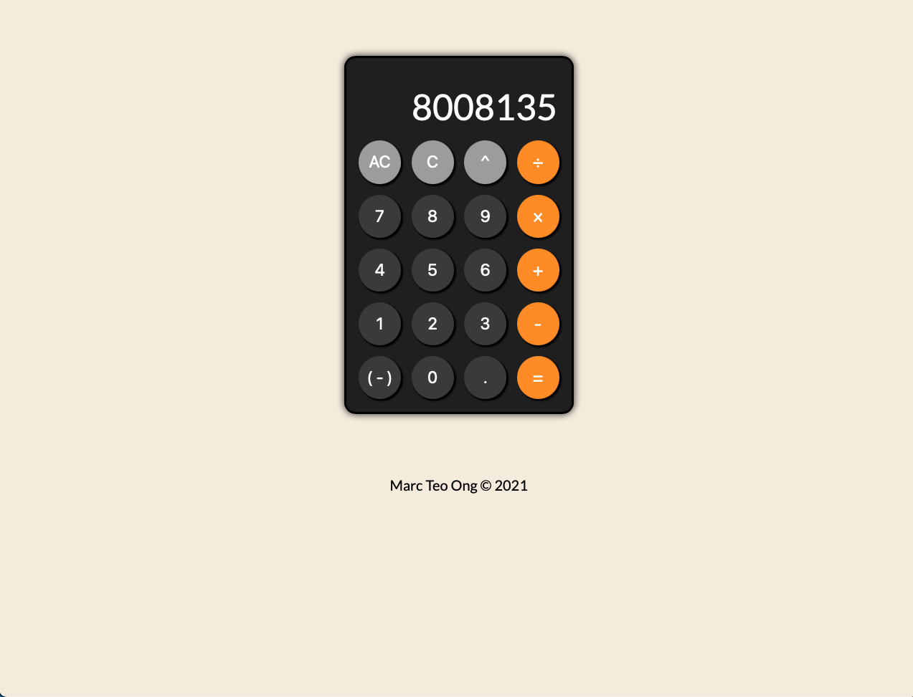
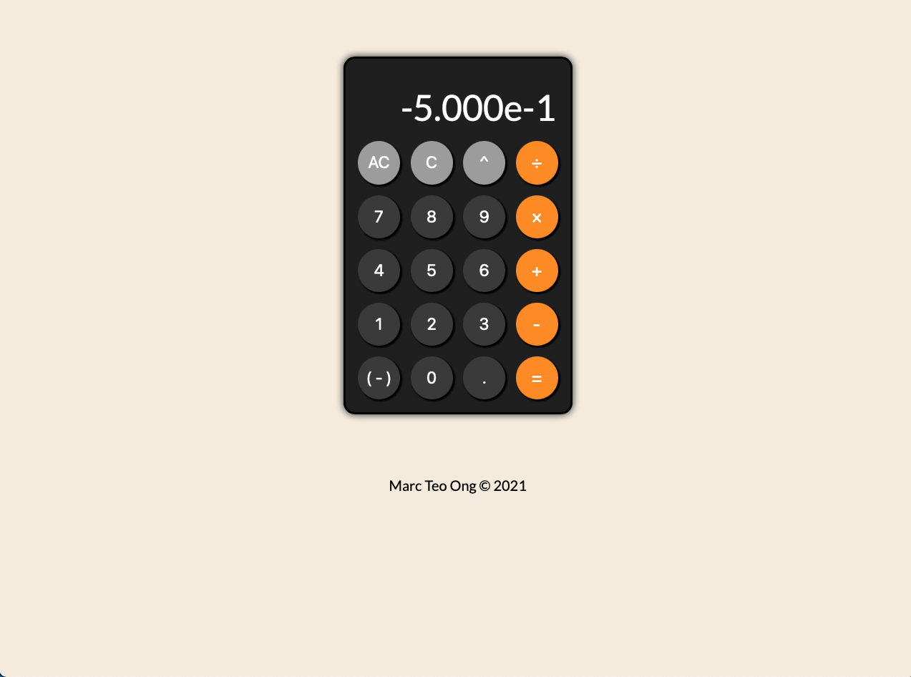
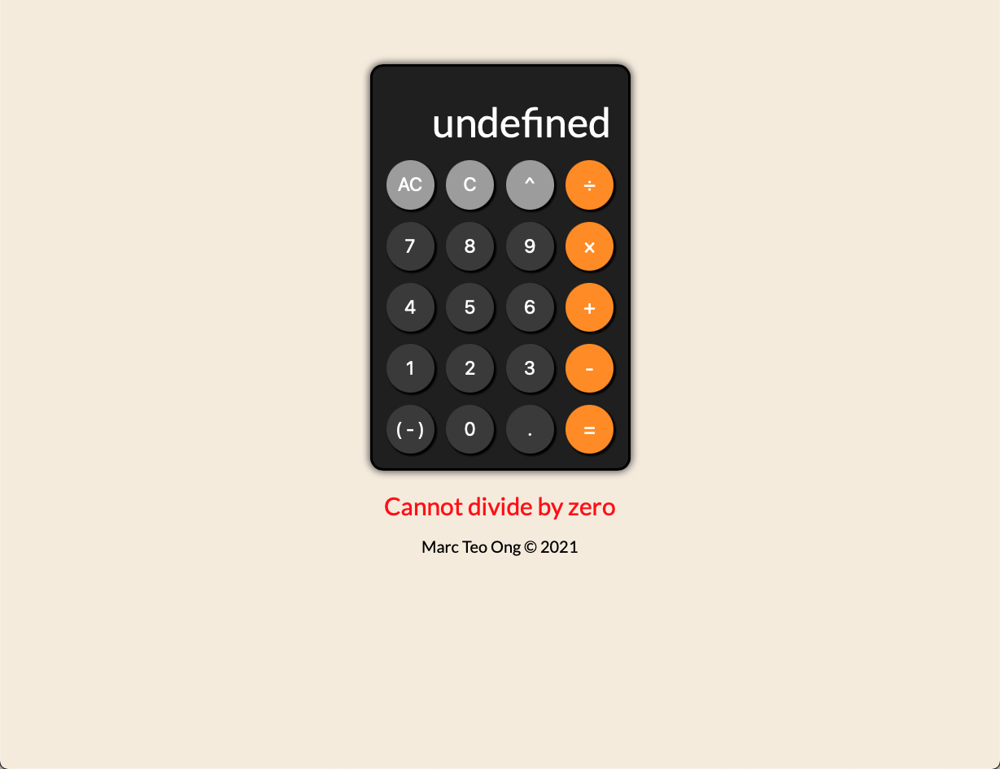
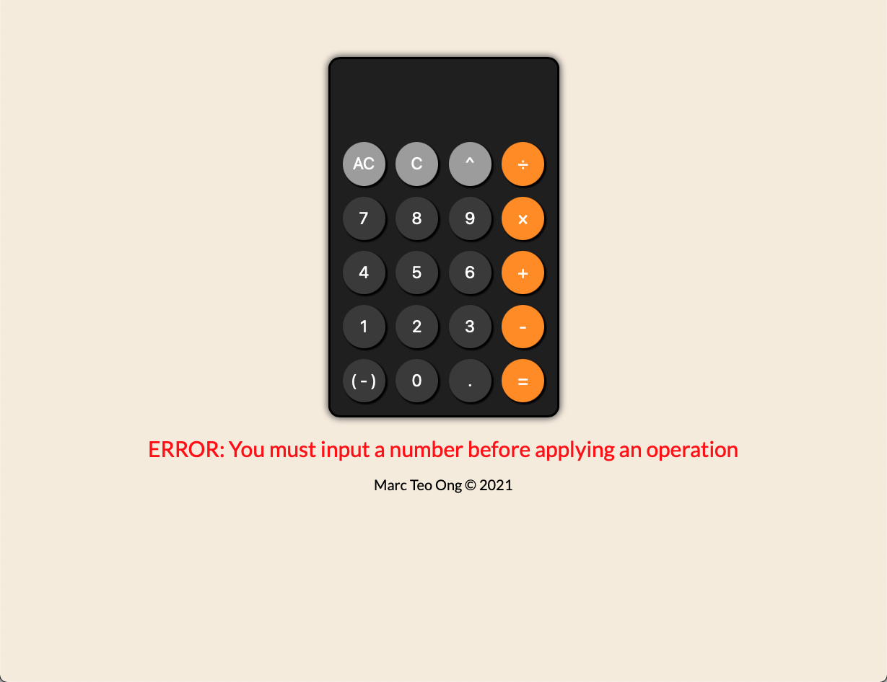

# Calculator
- Simple calculator app that can do addition, subtraction, multiplication, division, and exponent operations. 
- Press AC to wipe everything from memory. Press C just to delete the number currently displayed on the screen. 
- Supports decimals and negative numbers. 
- Automatically converts to scientific notation for very large or very small numbers, rounds long decimals. 
- Includes errors for things like zero division and trying to input operations without first inputting a number. 

